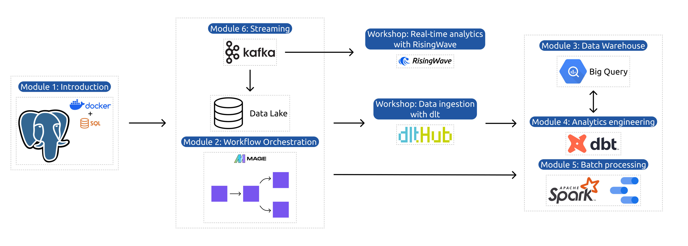

# Data Engineering
## Overview

## [Week1: Pre-Requisites (Docker, Terraform, SQL)](./Week1/README.md)
### Docker + PostgreSQL
Using Docker to run a PostgreSQL database locally.
### Terraform + Google Cloud Platform
Using Terraform to operate Google Cloud Platform (GCP) resources.

## [Week2: Data ETL(Extract, Transform, Load) with Mage](./Week2/HW/README.md)
### [Mage Workflow Orchestration Tool](./Week2/mage-zoomcamp/README.md)
### Extract Data From Various Sources
- Extract the last quarter of 2020's NYC Green Taxi Data from [DataTalksClub](https://github.com/DataTalksClub/nyc-tlc-data/releases/tag/green)
### Transform Data For Consistency
- Remove rows where the passenger count is equal to 0 or the trip distance is equal to zero.
- Create a new column lpep_pickup_date by converting lpep_pickup_datetime to a date.
- Rename columns in Camel Case to Snake Case, e.g. VendorID to vendor_id
- Assertion:
  1. vendor_id is one of the existing values in the column (currently)
  2. passenger_count is greater than 0
  3. trip_distance is greater than 0
### Load Data Into the Warehouse
- Export Cleaned Data to PostgreSQL in our Docker Container
- Export Cleaned Data to Google BigQuery
- Export Cleaned Data to Google Cloud Storage by partitioning the data by month

## [Week3: Data Warehouse with BigQuery](./Week3/README.md)
- Create a Data Warehouse in Google BigQuery
- Create External Table from Google Cloud Storage
- Create Non-partitioned and Partitioned Tables from External Table
- Query Data from Non-partitioned and Partitioned Tables

## [Workshop 1: Data Ingestion with dlt](./Workshop1/README.md)
### [dlt Pipeline Building Tool](https://dlthub.com/docs/build-a-pipeline-tutorial)
- Create a generator to extract data from a data source
- Create a pipeline to ingest data into an in-memory database (e.g. DuckDB) or a data warehouse (e.g. BigQuery)
- Replace or merge data in the in-memory database or data warehouse
- Query the data in the in-memory database or data warehouse

## [Week4: Analytics Engineering with Dbt Cloud and BigQuery](./Week4/README.md)
- Create a Dbt project with BigQuery as a source and target.
- Build up staging models from BigQuery tables.
- Compose a fact table from staging models and load it into BigQuery.
- Create a dashboard in Data Studio (Looker) with the fact table.

## [Week5: Batch Processing with Spark on GCP VM Instance](./Week5/README.md)
- Setup a GCP VM Instance
- Install Anaconda, Java and Spark, setup PySpark
- Utilize Jupyter Notebook to execute batch processing tasks using PySpark.
